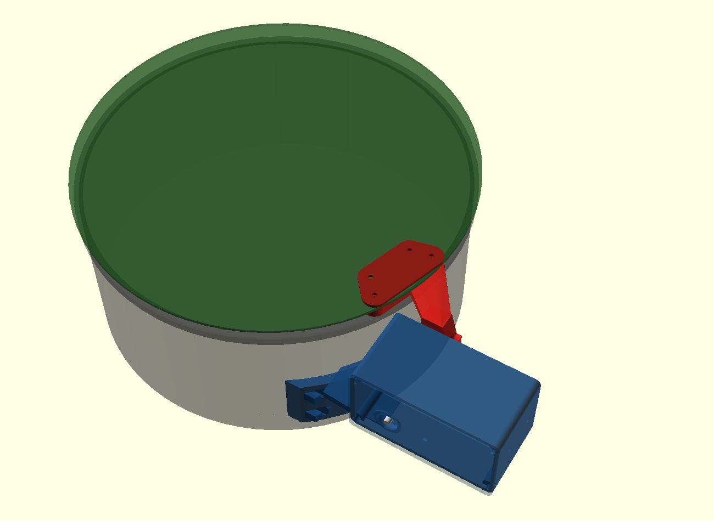

# GP1 FlipCap V4.2

Tappo antipolvere motorizzato per telescopi newtoniani, comandato da
**INDI / Ekos**. Un motore, un braccio, tutta la meccanica chiusa in una
scatola stampata che si fissa al tubo con due cinghie.



📘 **[MANUALE_MONTAGGIO_V4.2.pdf](MANUALE_MONTAGGIO_V4.2.pdf)** — 18 pagine,
dall'elenco dei pezzi da stampare fino alla configurazione di Ekos.

---

## Caratteristiche

| | |
|---|---|
| Motore | 1 × 28BYJ-48 5 V + ULN2003 |
| Riduzione | riduttore interno del 28BYJ + riduzione stampata 15:1 (modulo 0,8) |
| Corsa | 90°, circa 19 secondi |
| Albero di uscita | acciaio 6 mm su due cuscinetti 626ZZ |
| Finecorsa | 2 sensori Hall A3144 su piastra unica, magnete 6×3 su bandierina |
| Fissaggio | sella curva parametrica + due cinghie |
| Protocollo | Alnitak Remote Dust Cover, product ID 98 (`indi_flipflat`) |
| Default | tubo Ø362 mm, tappo Ø374 mm — entrambi parametrici |
| Materiale | ~410 cm³, circa 320 g di PETG in 10 pezzi |

Non è un pannello per i flat: copre e scopre, non ha luce integrata.

## Per cominciare

1. Stampa i dieci pezzi in `stl/` (elenco con volumi e orientamenti nel
   capitolo 0 del manuale). PETG o ASA — **non PLA**.
2. Procurati viteria, cuscinetti ed elettronica (capitoli 0.3 e 0.4).
3. Scegli il materiale del tappo — vedi sotto, è la decisione che pesa di più.
4. Segui il manuale: Parte A meccanica, Parte B elettronica, Parte C
   integrazione.

Se il tuo tubo non è da 362 mm, rigenera l'housing con il tuo valore:

```bash
openscad -o stl/housing.stl -D 'part="housing"' -D ota_d=355 gp1_flipcap_V4_2.scad
```

## La scelta che conta: il materiale del tappo

Il 28BYJ-48 con questa riduzione eroga circa **0,32 N·m**. La coppia necessaria
per staccare il tappo dipende dalla massa del disco e da quanto è alto il tubo
quando il tappo si muove. Il *margine* è il rapporto fra le due: **sotto 1,00
non si apre**.

| Disco Ø374 | Massa | Tubo a 0° | a 30° | a 45° | allo zenit |
|---|---|---|---|---|---|
| Forex / PVC espanso 1,5 mm | 109 g | 4,64× | 1,82× | 1,48× | 1,28× |
| Forex 2 mm | 137 g | 3,98× | 1,49× | 1,21× | 1,04× |
| Forex 3 mm | 192 g | 3,10× | 1,10× | **0,88×** | **0,76×** |
| **Polipropilene alveolare 3 mm** | **76 g** | **5,78×** | **2,46×** | **2,03×** | **1,76×** |
| Depron / XPS 6 mm | 50 g | 7,17× | 3,41× | 2,85× | 2,50× |

Il tappo si muove solo a telescopio fermo (si apre dopo aver sparcheggiato, si
chiude dopo aver parcheggiato), quindi quello che conta è **l'altezza a cui
parcheggi**, non quella a cui fotografi. Con il Forex 3 mm il limite è 36° di
altezza. Il polipropilene alveolare da 3 mm resta sopra 1,7× in qualsiasi
posizione ed è la scelta consigliata.

> Gli STL sono generati per un tappo da **3 mm**. Per altri spessori rigenera
> `mono_arm.stl` (appendice E del manuale).

## File

```
MANUALE_MONTAGGIO_V4.2.pdf     manuale illustrato, 18 pagine
gp1_flipcap_V4_2.scad          modello parametrico, tutti i pezzi
CHANGELOG_V4.2.md              cosa e' cambiato dalla V4.1, con i numeri
MONTAGGIO.md                   indice del manuale
LICENSE / NOTICE               CERN-OHL-S v2
firmware/
  GP1_Alnitak_DustCover_V4_2/  sketch Arduino
  build/                       .hex precompilato per Nano
docs/
  BOM_meccanica.csv  BOM_elettronica.csv  COLLEGAMENTI.md
  verifica_collisioni.py       verifica geometrica automatica sugli STL
  VERIFICA_COLLISIONI.txt      output della verifica
  contenuto_manuale.py         testo del manuale
  genera_figure_manuale.py     render e disegni quotati
  genera_manuale_pdf.py        impaginazione del PDF
  genera_dae.py                assieme COLLADA per SketchUp
  GP1_V4_2_assieme_SketchUp.dae
  SHA256SUMS.txt               checksum di tutti i file
  manuale/  render/            figure
stl/
  housing  cover  motor_bracket  output_gear  compound_gear  motor_pinion
  mono_arm  lid_backplate  hall_plate  magnet_flag
  accessori/GP1_electronics_box_MINI.stl
```

## Firmware

Sketch per Arduino Nano, emula il protocollo Alnitak. Pilotaggio full-step a
2 fasi attive con rampa di accelerazione, antirimbalzo sui finecorsa, limite di
extracorsa a 8100 passi.

Compilato e verificato:

```
arduino-cli 1.3.1 - core arduino:avr 1.8.6 - avr-gcc 7.3.0-atmel3.6.1-arduino7
flash 3594/30720 byte (11%) - RAM 261/2048 byte (12%) - 0 errori, 0 warning
```

Il `.hex` precompilato è in `firmware/build/` per chi vuole flashare senza
installare l'IDE.

## Verifica geometrica

```bash
python docs/verifica_collisioni.py
```

Campiona le mesh STL reali e controlla su tutta la corsa: integrità dei solidi,
braccio contro scatola, staffa contro scatola e ingranaggi, disco del tappo
contro scatola, braccio contro tubo, piastra sensori contro bandierina, ed
extracorsa in avaria. Richiede numpy e scipy. Output corrente in
[docs/VERIFICA_COLLISIONI.txt](docs/VERIFICA_COLLISIONI.txt).

Luci minime verificate: disco/scatola 7,7 mm a fine apertura, braccio/scatola
2,0 mm su tutta la corsa, braccio/tubo 2,5 mm, traferro magnetico 2,9 mm.

## Se vieni dalla V4.1

La V4.1 aveva tre difetti bloccanti (supporto motore staccato dalla scatola,
braccio che compenetrava l'housing su tutta la corsa, tappo che sbatteva contro
la scatola in apertura). L'housing stampato resta utilizzabile con quattro fori
da fare: vedi l'appendice F del manuale e [CHANGELOG_V4.2.md](CHANGELOG_V4.2.md).

I render di confronto sono in [docs/render/](docs/render/).

## Licenza

**CERN Open Hardware Licence Version 2 – Strongly Reciprocal** (CERN-OHL-S v2).
Testo completo in [LICENSE](LICENSE), sintesi in [NOTICE](NOTICE).

Puoi usare, modificare e ridistribuire il progetto, anche commercialmente. Se
distribuisci un prodotto basato su questi file o una versione modificata dei
file stessi, devi rendere disponibile la sorgente completa corrispondente sotto
la stessa licenza.

## Avvertenza

Progetto amatoriale fornito **così com'è, senza garanzia**. Le verifiche
geometriche valgono per il modello con i parametri di default: se li cambi,
rilancia la verifica. Chi monta questo meccanismo su un telescopio è
responsabile della propria verifica meccanica ed elettrica.
