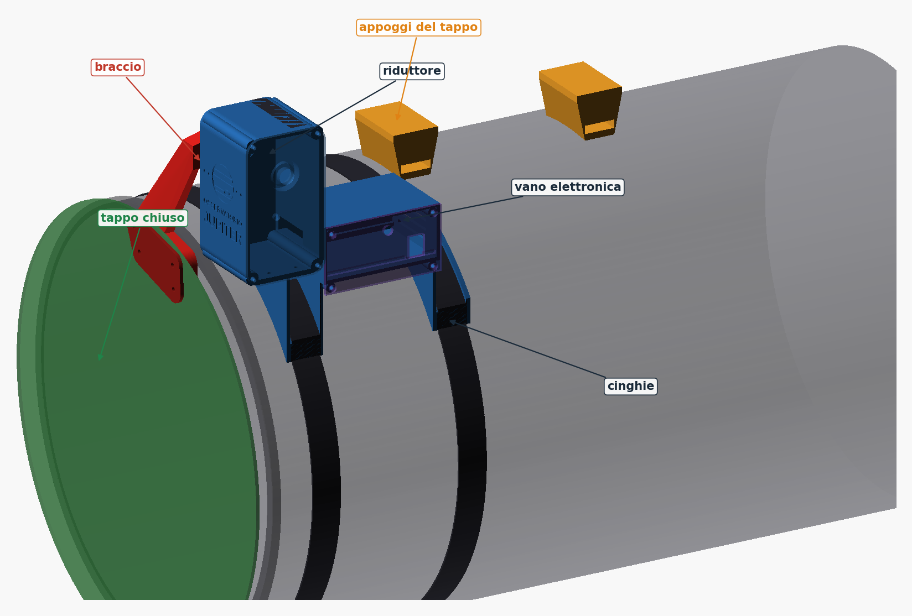

# GP1 FlipCap V6

Tappo antipolvere motorizzato per telescopi newtoniani, comandato da
**INDI / Ekos**. Un motore e un braccio: aprendosi il tappo ruota di **270°**,
scavalca la scatola e si **posa sul tubo**, così il vento non lo fa vibrare.
Riduttore ed elettronica stanno in un'unica scatola stampata, fissata al tubo
con due cinghie a strappo.



📘 **[MANUALE_MONTAGGIO_V6.pdf](MANUALE_MONTAGGIO_V6.pdf)**: dal primo pezzo
stampato fino alla configurazione di Ekos, passo per passo, per chi costruisce
da zero.

---

## Caratteristiche

| | |
|---|---|
| Motore | 28BYJ-48 5 V + scheda ULN2003 |
| Riduzione | riduttore interno del 28BYJ + treno stampato 15:1 (modulo 0,8) |
| Corsa | 270°, circa 55 secondi; da aperto il tappo appoggia su due supporti sul tubo |
| Albero di uscita | acciaio Ø6 × 100 mm su due 626ZZ, bloccato da distanziali stampati |
| Finecorsa | 2 sensori Hall A3144 su piastra registrabile, magnete 6×3 su bandierina |
| Elettronica | Arduino Nano + ULN2003 + LM2596 nel vano della scatola, su un vassoio |
| Alimentazione | 12 V del setup; USB verso il PC |
| Fissaggio | due selle e due cinghie a strappo da 25 mm |
| Protocollo | Alnitak Remote Dust Cover, product ID 98 (`indi_flipflat`) |
| Default | tubo Ø362 mm (Sky-Watcher Quattro 300), tappo Ø374 mm, tutto parametrico |
| Stampa | 14 file, circa 600 cm³ di PETG o ASA; più 2 assi di prova facoltativi |
| Logo | Osservatorio Jupiter, inciso sulla faccia anteriore della scatola (`logo=false` per toglierlo) |

Non è un pannello per i flat: copre e scopre, non ha una luce.

## Per cominciare

1. Misura il diametro del tuo tubo (circonferenza ÷ π). Se non è 362 mm,
   rigenera `housing` e `cap_rest` (appendice E del manuale).
2. Stampa i pezzi in `stl/`: sono già orientati per la stampa. PETG o ASA,
   **non PLA**.
3. Procurati viteria, cuscinetti ed elettronica (capitoli 0.4 e 0.5).
4. Per il tappo usa **polipropilene alveolare da 3 mm** (vedi sotto).
5. Segui il manuale nell'ordine: elettronica a banco, riduttore, telescopio.

```bash
openscad -o stl/housing.stl -D 'part="housing"' -D ota_d=355 gp1_flipcap_V6.scad
openscad -o stl/cap_rest.stl -D 'part="cap_rest"' -D ota_d=355 gp1_flipcap_V6.scad
```

## Il tappo deve essere leggero

Il braccio tiene il tappo a circa 27 cm dall'albero e il 28BYJ-48, con questa
riduzione, eroga circa **0,32 N·m**. Il *margine* è il rapporto fra coppia
disponibile e coppia richiesta nel punto peggiore della corsa: **sotto 1 il
tappo non si alza**.

| Disco Ø374 | Massa | Margine |
|---|---|---|
| **Polipropilene alveolare 3 mm** | **53 g** | **1,6** (consigliato) |
| Depron / XPS 6 mm | 26 g | 2,4 (fragile) |
| Forex 1,5 mm | 91 g | 1,1 (al limite) |
| Forex 2 mm | 121 g | 0,85: non si alza |
| Forex 3 mm | 181 g | 0,60: non si alza |

Per un tappo più pesante serve un motore più forte (NEMA 14 o 17).

## File

```
MANUALE_MONTAGGIO_V6.pdf       manuale di costruzione illustrato
gp1_flipcap_V6.scad            modello parametrico: tutti i pezzi e l'assieme
LICENSE / NOTICE               CERN-OHL-S v2
stl/                           i 14 pezzi da stampare, già orientati, più
                               test_shaft e test_pin: assi di prova in
                               plastica, per provare prima dell'acciaio
firmware/
  GP1_FlipCap_V6/              sketch Arduino
  build/                       .hex precompilato per Nano + istruzioni avrdude
docs/
  BOM_meccanica.csv  BOM_elettronica.csv  COLLEGAMENTI.md
  verifica_collisioni.py       verifica geometrica automatica
  VERIFICA_COLLISIONI.txt      risultato della verifica
  genera_figure_manuale.py     render e schemi del manuale
  contenuto_manuale.py         testo del manuale
  genera_manuale_pdf.py        impaginazione del PDF
  genera_dae.py                assieme per SketchUp
  GP1_V6_assieme.dae           assieme COLLADA (SketchUp, Blender, FreeCAD...)
  manuale/                     figure del manuale
  SHA256SUMS.txt               checksum dei file
```

## Il modello

Apri `gp1_flipcap_V6.scad` con OpenSCAD e premi F5: compare l'assieme
completo, con il tubo, il tappo e tutti i pezzi. `cap_angle` muove il tappo
(0 = chiuso, -270 = parcheggiato), gli interruttori `show_*` accendono e
spengono i singoli pezzi. Per esportare un pezzo imposta `part`, premi F6 ed
esporta l'STL: esce già orientato per la stampa. Serve la libreria MCAD, già
inclusa in OpenSCAD. `logo=false` toglie il logo inciso sulla scatola; il
carattere è il Liberation Sans compreso in OpenSCAD, quindi l'STL esce uguale
su ogni PC.

## Firmware

Sketch per Arduino Nano che emula il protocollo Alnitak: full-step a due fasi
con rampa di accelerazione, antirimbalzo sui sensori, limite di passi e di
tempo se un sensore non scatta, bobine spente a motore fermo. Il driver INDI
ripete il comando dopo 30 secondi: il firmware riconosce la ripetizione e la
ignora, e la corsa da 55 secondi finisce regolarmente.

```
arduino-cli 1.3.1 - core arduino:avr 1.8.6 - fqbn arduino:avr:nano
flash 3612/30720 byte (11%) - RAM 261/2048 byte (12%) - 0 errori, 0 warning
```

## Verifica geometrica

```bash
python docs/verifica_collisioni.py
```

Esporta da OpenSCAD tutti i pezzi in posizione di montaggio e controlla sulle
mesh: che ogni STL sia un solido unico, che i pezzi fermi non si
compenetrino, le luci lungo tutta la corsa di 270° (braccio, contropiastra e
disco del tappo contro scatola, coperchi, appoggi e tubo; bandierina contro
sensori) e la posizione di parcheggio. Serve Python con numpy e scipy; impiega
una ventina di minuti.
Risultato attuale in [docs/VERIFICA_COLLISIONI.txt](docs/VERIFICA_COLLISIONI.txt).

## Se hai già stampato pezzi delle versioni precedenti

Il composto e il pignone hanno la stessa geometria dalla V4.1 in poi e si
riusano. L'ingranaggio di uscita si riusa dopo averlo forato: nelle V4.x il
foro del grano cadeva sulla faccia invece che nel mozzo (appendice F del
manuale); il file della V6 ha già il foro giusto. La bandierina della V4.1 ha
la tasca del magnete chiusa dentro il pezzo e va ristampata. Tutto il resto è
nuovo.

Gli ingranaggi della prima versione, prima della V4.1, sono diversi e non
ingranano: l'uscita giusta ha 70 denti e 57,6 mm di diametro esterno. Se i tuoi
non corrispondono, ristampali da `stl/` senza scalarli.

## Licenza

**CERN Open Hardware Licence Version 2 – Strongly Reciprocal** (CERN-OHL-S v2).
Testo completo in [LICENSE](LICENSE), sintesi in [NOTICE](NOTICE).

Puoi usare, modificare e ridistribuire il progetto, anche commercialmente. Se
distribuisci un prodotto basato su questi file o una versione modificata dei
file stessi, devi rendere disponibile la sorgente completa corrispondente
sotto la stessa licenza.

## Avvertenza

Progetto amatoriale fornito **così com'è, senza garanzia**. Le verifiche
geometriche valgono per il modello con i parametri di default: se li cambi,
rilancia la verifica. Chi monta questo meccanismo su un telescopio è
responsabile delle proprie verifiche meccaniche ed elettriche.
